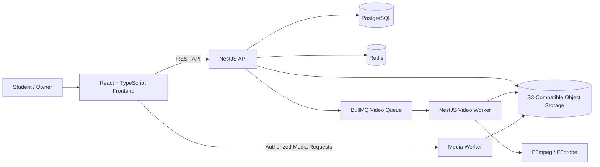

<div align="center">

# Learning Management System

**A production-oriented, single-owner LMS for course publishing, secure student access, video delivery, progress tracking, and platform operations.**


</div>

---

## Overview

This project is a full-stack Learning Management System designed around a **single-owner operating model**.

It combines a student-facing learning experience with owner-only course, enrollment, media, user, and operational management. The backend is implemented as a modular NestJS monolith with a separate video-processing worker, while the frontend is a React + TypeScript application with protected learning and owner workflows.

The repository also includes API contracts, an ERD, authorization rules, state-machine documentation, production runbooks, Docker infrastructure, backup tooling, security checks, and automated tests.

## Core Capabilities

### Student Experience

- Account registration and authentication
- Session and device management
- Public course catalogue
- Authorized course access
- Curriculum and lesson navigation
- Learning-progress tracking
- HLS video playback
- Short-lived authorized playback sessions
- Password reset and credential lifecycle

### Owner Operations

- Course creation and curriculum management
- Course publishing workflows
- Student enrollment and access grants
- Video upload and processing operations
- Student lookup for owner workflows
- Operational reporting
- Audit and security operations
- Platform health and dependency monitoring

## Architecture



### Backend

The backend is a **NestJS modular monolith** with separate API and video-worker applications. PostgreSQL is accessed through Prisma, Redis supports queue and platform workflows, and BullMQ coordinates background video jobs.

Multi-step operational tooling includes database migrations, seeding, backup/restore verification, secret scanning, security acceptance checks, and production readiness scripts.

### Frontend

The frontend is built with React and TypeScript using Vite. TanStack Query handles server-state workflows, React Router manages navigation, HLS.js provides video playback, and Zod is used for client-side validation.

### Media Delivery

The platform includes a dedicated media worker and an S3-compatible object-storage layer. The backend also includes a video worker with FFmpeg/FFprobe tooling for media-processing workflows.

## Tech Stack

| Layer | Technologies |
| --- | --- |
| **Frontend** | React 19, TypeScript, Vite, React Router, TanStack Query |
| **UI / Motion** | GSAP, Motion, Lucide React, OGL |
| **Video Playback** | HLS.js |
| **Backend** | Node.js 24, NestJS 11, TypeScript |
| **Database** | PostgreSQL 17, Prisma 7 |
| **Queue / Cache** | Redis 8, BullMQ |
| **Authentication** | JWT, Passport, Argon2 |
| **Validation** | class-validator, Joi, Zod |
| **Storage** | S3-compatible object storage / MinIO |
| **Media Processing** | FFmpeg, FFprobe |
| **Media Edge Worker** | Cloudflare Workers / Wrangler |
| **API Documentation** | OpenAPI 3.1, Swagger |
| **Testing** | Jest, Supertest, Vitest, Testing Library |
| **Infrastructure** | Docker, Docker Compose |

## API Domains

The V1 API is organized around the following areas:

- **Health** — liveness, readiness, and dependency checks
- **Auth** — registration, login, refresh, logout, and password lifecycle
- **Account** — current-user profile, devices, and sessions
- **Catalogue** — published public course metadata
- **Learning** — authorized curriculum and student progress
- **Playback** — authorized short-lived playback sessions
- **Owner Courses** — owner-only curriculum management
- **Owner Enrollments** — owner-only access grants
- **Owner Videos** — upload and processing operations
- **Owner Users** — student lookup for owner workflows
- **Owner Operations** — support, audit, security, and operational reporting

## Security & Reliability

The system includes several production-oriented controls:

- JWT-based authentication
- Rotating refresh-token workflows
- Role and authorization boundaries
- Argon2 password hashing
- Helmet security headers
- API throttling
- Input validation
- Session revocation
- Device-aware authentication workflows
- Database transactions through application services
- Health and readiness endpoints
- Secret scanning
- Backup, restore, and restore-verification tooling
- Authorization matrix and documented state machines

## Local Infrastructure

The local Docker environment provides:

```text
PostgreSQL
Redis
MinIO / S3-compatible object storage
```

Start the infrastructure from the backend environment:

```bash
cd backend
npm install
npm run infra:up
```

Generate Prisma artifacts and run migrations:

```bash
npm run prisma:generate
npm run db:migrate:dev
```

Start the API:

```bash
npm run start:api:dev
```

Start the video worker in another terminal:

```bash
npm run start:worker:dev
```

Start the frontend:

```bash
cd frontend
npm install
npm run dev
```

## Quality Checks

### Backend

```bash
npm run typecheck
npm run lint
npm test
npm run test:e2e
npm run contracts:lint
```

### Frontend

```bash
npm run typecheck
npm run lint
npm test
npm run format:check
```

### Media Worker

```bash
cd media-worker
npm install
npm run check
```

## Documentation

The repository contains supporting engineering documentation under [`docs/`](docs/), including:

- [`openapi.yaml`](docs/openapi.yaml) — canonical API contract
- [`erd.dbml`](docs/erd.dbml) — database model
- [`authorization-matrix.md`](docs/authorization-matrix.md) — access-control rules
- [`state-machines.md`](docs/state-machines.md) — lifecycle and state transitions
- [`error-catalog.md`](docs/error-catalog.md) — application error definitions
- [`production-runbook.md`](docs/production-runbook.md) — production operations guidance

## Project Structure

```text
Learning-Management-System/
├── backend/
│   ├── apps/
│   │   ├── api/
│   │   └── video-worker/
│   ├── libs/
│   ├── prisma/
│   └── scripts/
│
├── frontend/
│   └── src/
│       ├── app/
│       ├── components/
│       ├── layouts/
│       ├── lib/
│       └── pages/
│
├── media-worker/
├── docs/
├── deploy/
├── screenshots/
├── compose.yaml
└── compose.production.yaml
```

## Screenshots

A dedicated [`screenshots/`](screenshots/) folder is included for product visuals.

Recommended screenshots:

| Area | Suggested file |
| --- | --- |
| Landing page | `screenshots/landing-page.png` |
| Course catalogue | `screenshots/course-catalogue.png` |
| Course page | `screenshots/course-details.png` |
| Learning dashboard | `screenshots/learning-dashboard.png` |
| Lesson / video player | `screenshots/lesson-player.png` |
| Owner courses | `screenshots/owner-courses.png` |
| Course editor | `screenshots/owner-course-editor.png` |
| Owner operations | `screenshots/owner-operations.png` |

Once the screenshots are uploaded, they can be embedded directly in this section.

## Engineering Focus

This project is built around more than basic CRUD functionality. Its main engineering concerns include:

- authorization boundaries between students and the owner
- secure session and playback lifecycles
- asynchronous video processing
- resilient media delivery
- explicit domain and state transitions
- operational observability
- backups and recovery
- API and database contracts
- testable modular backend design
- production-oriented deployment workflows

---

<div align="center">

Developed by **[Eyad Aboelftoh](https://github.com/Eyad20210197)**

</div>
